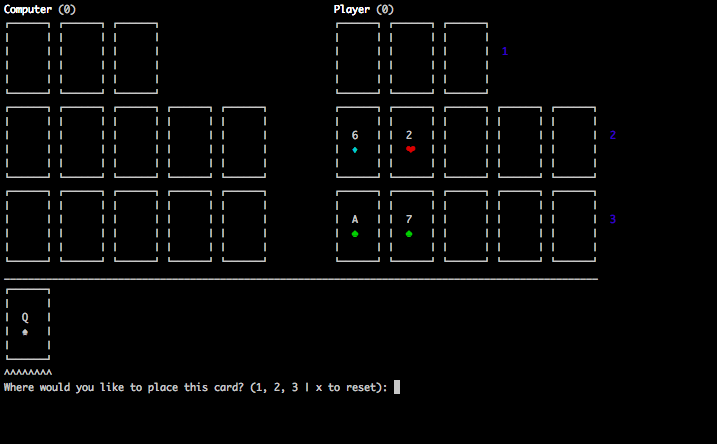
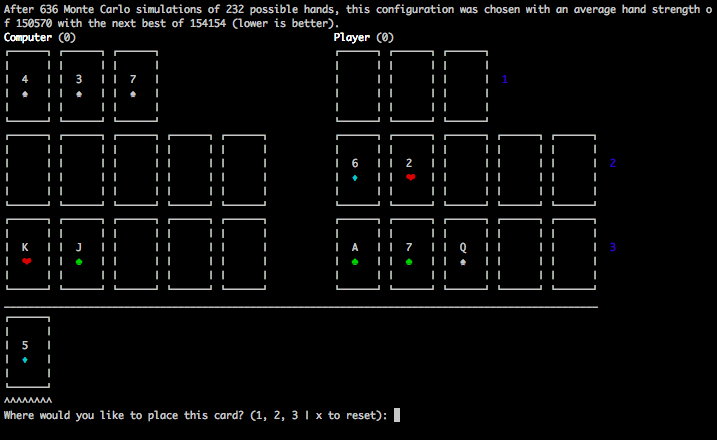

pyOFC
=====

__pyOFC__ allows users to play Open Face Chinese Poker against an advanced and real-time-calculated AI via a colorful and user-friendly command line interface.

_Markdown and HTML versions of this README are available in the source distribution._

[Github Link](https://github.com/wesny/pyofc)

#### Author
Sweyn Venderbush  
sv298  
sweyn.venderbush@yale.edu  

#### Goal
While a lot of work has been done on game trees for more traditional variants of poker (for example, Limit Texas Hold-me is pretty much considered solved and a team of Carnegie Mellon tested [their poker bot against top players](http://www.wired.com/2015/05/humans-play-ai-texas-hold-em-now/) this past summer), very little work has been done on Open Face Chinese Poker. In part, this because it is a new game and played much less than Texas Holdem, but nonetheless is an incredibly interesting challenge. My goal was to explore the approaches used in poker game trees in general, with focus on the OFC game tree and attempt to come up with some strategies for a potential path to a solution for basic OFC. This project is very much not a solution to OFC but does point out some interesting challenges involved and plays at a pretty decent level, beating beginner and some intermediate players.

## Screenshots

#### User Card Placement


#### AI Explanation After Placement


#### End Game and Scoring


## Open Face Chinese Poker Rules

#### How to Play

Open Face Chinese Poker is a variant of 'regular' Chinese Poker. In regular Chinese Poker, each player is dealt 13 cards 'in the hole'. They then set the cards in three rows of poker hands. 
 
For the hand to be set properly, the back row must be a stronger hand than the middle, and the middle stronger than the front, as illustrated above. A full house in the back, two pair in the middle, and a pair in front is an example of a properly set hand. If these rules are broken, however, the hand is considered fouled or misset (mis-set). Two pair in the back, a flush in the middle and a pair in front is an example of a fouled/misset hand. 

In Open Face Chinese Poker, each player is dealt only 5 cards 'in the hole'. They set these 5 cards and then are dealt one card at a time until each player has received 13 total cards. The same row strength and fouling rules apply.

#### Scoring

Players' front, middle and back rows are compared, and each row won is worth 1 point. If a player has won 2 of 3 rows, they win a total of 1 point (1+1-1). Additional points are awarded for a 'scoop' and also for sub-hands (rows) that qualify for royalties. 

__Scoop__ - If a player wins all three rows, they have 'scooped' the opponent and receive a three point bonus. In total, scooping is worth 6 points: 1+1+1 for winning all three rows, and 3 for the scoop bonus. 

__Ties__ - An example of a common tie: player A wins two of three rows, e.g. the front and middle with a pair of 66 in front, and player B wins the back row with a straight. player A wins 1 point for taking 2 of 3 rows plus the 1 point royalty for 66 in front, for a total of 2 points. Player B, however, is awarded 2 points for the back row straight, and the scores cancel each other. 

Another tie possibility happens rarely but will occur when, for example, player A wins one row, player B wins one row, and both players have the same hand in the third row (885 in front, i.e.). 

__Fouling__ - The penalty for fouling is -6 points; in other words, an automatic scoop for the opponent if they have a properly set hand. If a player has a QQ7 in front and QQ654 in the middle, this is a fouled hand. QQ7 in front and QQ982, however, is a proper set and is not a foul. If both players foul, the hand is a tie at 0 points. 

_Adapted from [Open Face Odds rules](http://www.openfaceodds.com/rules.html) in order to reflect the rules of pyOFC._

## Usage

#### Running pyOFC

```
python pyOFC.py [-h] [-e] [--fivecardtime FIVECARDTIME] [--onecardtime ONECARDTIME]

optional arguments:
  -h, --help            show this help message and exit
  -f FIVECARDTIME, --fivecardtime FIVECARDTIME
                        # of seconds used for computer to place initial cards
                        (Default: 5)
  -o ONECARDTIME, --onecardtime ONECARDTIME 
                        # of seconds used for computer to place subsequent
                        cards (Default: 3)
  -e, --explain         Print explanation for each AI placement
```

#### How to Play
- The AI makes does simulations in real time for the number of seconds specified by the `FIVECARDTIME` and `ONECARDTIME` options. 
- The player and the AI take turns making the first move.
- The hands are denoted by the number 1, 2, and 3, with 1 being the top hand and 3 the bottom.
- To place your first 5 cards:
    - Select 1, 2, or 3 to place the first card (as specified) in a hand and press enter to complete the selection.
    - Continue for the other 4 cards.
    - At any point, press `x` at the prompt to reset all cards from that hand
    - After placing all 5 cards, press 'y' and enter to submit your placement or `n` to reset the cards.
- To place subsequent cards:
    - Select 1, 2, or 3 to place the card.
    - After placing all 5 cards, press 'y' and enter to submit your placement or `n` to reset the card.
- At the completion of the hand, you will see the score from the previous hand and can choose `y` or `n` depending on if you want to play another hand or exit.

#### Explanation
When asked to explain its decision making process (using the `-e` or `--explain` flags), the AI will print the number of simulations run on the number of potential hands after pruning as well as the top hand strength (lower is better) followed by the runner-up hand strength. This allows you to see how close the best move was to the second best move, as well as whether the number of simulations was statistically significant. For example, if the AI is only given 1 second to run simulations on 240 possible starting hands, the placement may very well be close to random.

## AI Theory
The main challenge that games of Open Face Chinese Poker present is that the game tree is absolutely massive. For every move that either player does, the game branches by the number of cards left in the deck. Even just the number potential starting hands for each player is 52 choose 10 or 15,820,024,220. Each of these hands can be placed in more than 200 different ways. Thus, it is infeasible to do something like Minimax, even with Alpha Beta Pruning.

Thus, I decided to utilize Monte Carlo Simulations. There are still a number of challenges related to the Monte Carlo Simulations. For example, having to run simulations for just the starting hands required, as above, 15,820,024,220 possible scenarios to be run a statistically significant amount of times. To add to this, as more cards are played, the number of possible combinations of  remaining cards in the deck becomes massively larger. At the extreme, when the last card, there are 27 cards left in the deck, meaning there are 52 choose 27 or 4.8\*10<sup>14</sup> possible decks. 

Because of this, I decided to run Monte Carlo simulations in real time. I allow the user to designate the number of seconds allowed for the computer to run simulations (broken down by the first 5 cards and the later single card placements, since the 5 card placements are much more complex). There was still the question of how to run a simulation, since the perfect simulation would involve a massive amount of branching after each card placement. Instead, I chose to fill in the hand with random cards and evaluate that hands strength and would do this as many times as were allowed by the number of seconds allotted to the placement. The theory behind this was even though the placements were random, over many trials the better starting hands would win out. This strategy has proven to be successful. I weighted a hand that busts very badly, so the computer tends to play conservatively and attempts to get a non-busting hand over a riskier but potentially better one.

One final concern was the issue of starting hand positions. With almost 240 starting hands, simulating all of them, even for the default period of 5 seconds, would not sufficiently find the correct starting position. In order to solve this, I implemented some game-specific optimizations. Flushes and potential flushes are always placed together, so I eliminated all starting hands that did not fulfill this requirement. Also, pairs that were not part of a potential flush should also be placed together. This cuts the potential starting positions for "good" hands to under 100 in most cases. In the worst case scenario with the potential positions at 240, the play made by the AI is likely to be sub-optimal.

## Credits

#### Libraries
- Heavily modified version of [Deuces](https://github.com/worldveil/deuces), especially in terms of allowing it to evaluate 3 card hands and changing the way that cards are displayed in order to enable the user interface.
- [Termcolor](https://pypi.python.org/pypi/termcolor)

#### References
- [Dissertation by Alastair Kerr](https://alastairkerr.co.uk/Dissertation%204177303.pdf)
- [Kachusi, an OFC AI](http://scrambledeggsontoast.github.io/2014/06/26/artificial-intelligence-ofcp/#the-ai-algorithm)
